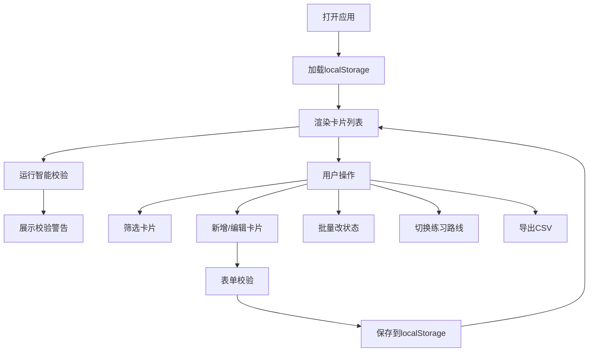

## 1. 产品概述
金工錾刻练习卡管理系统，面向金属工艺从业者/学员，用于系统化管理錾刻练习任务、工具准备清单和复盘记录，辅助学员按难度进阶练习并追踪进度。

- 核心价值：将散落在便签/笔记中的练习计划结构化，提供分级筛选、智能校验、练习路线生成等功能，帮助学员高效、科学地进行錾刻技法训练。
- 目标用户：金工錾刻初学者、进阶学员、工坊指导老师。

## 2. 核心功能

### 2.1 用户角色
| 角色 | 注册方式 | 核心权限 |
|------|----------|----------|
| 单用户（本地） | 无需注册，本地存储 | 全部功能（增删改查、筛选、导出、练习路线） |

### 2.2 功能模块
1. **卡片管理区**：练习卡列表、新增/编辑/删除、复制、收藏、批量改状态
2. **筛选工具栏**：按金属规格、难度、状态、责任人、时长区间多条件筛选
3. **智能校验面板**：自动检测编号重复、时长过长、常见失误为空、责任人过载、重点卡缺提示
4. **练习路线模式**：按难度递增自动生成连续练习清单
5. **CSV导出**：将当前筛选结果或全部卡片导出为CSV文件

### 2.3 页面详情
| 页面名称 | 模块名称 | 功能描述 |
|----------|----------|----------|
| 主应用（单页） | 顶部标题栏 | 应用名、新增卡片按钮、导出CSV按钮、练习路线切换 |
| | 筛选工具栏 | 规格/难度/状态/责任人下拉、时长滑块、重置筛选 |
| | 智能校验区 | 展示5类校验结果警告，可点击定位 |
| | 卡片列表区 | 网格布局展示卡片，支持多选、批量操作 |
| | 卡片详情（弹窗/抽屉） | 完整表单：编号、规格、难度、步骤、时长、失误、责任人、状态、复盘提示 |
| | 练习路线视图 | 按难度排序的线性清单，显示进度 |

## 3. 核心流程
用户打开应用 → 加载 localStorage 中的卡片数据 → 展示卡片列表和校验结果 → 用户可：
- 筛选卡片 → 查看/编辑 → 自动保存
- 新增卡片 → 填写表单 → 校验通过 → 保存
- 勾选多张卡片 → 批量修改状态
- 切换练习路线模式 → 查看难度递增清单
- 点击导出 → 生成CSV下载

## 4. 界面设计

### 4.1 设计风格
- **主色调**：紫铜色 `#B87333`（呼应金属工艺）、深錾蓝 `#2C3E50`
- **辅助色**：暖金色 `#D4A76A`、铁灰 `#7F8C8D`
- **背景**：暗金属质感渐变，带细微纹理
- **按钮**：圆角8px，金属浮雕质感，hover有微亮效果
- **字体**：标题使用 "Cinzel"（衬线，古典金属感），正文使用 "Noto Sans SC"
- **布局**：卡片式网格布局，顶部固定工具栏
- **图标**：使用金属/工具相关emoji：🔨 ⚙️ 📋 ⭐ 🔍 📤

### 4.2 页面设计总览
| 页面 | 模块 | UI元素 |
|------|------|--------|
| 主应用 | 标题栏 | 深色底，金色标题文字，左右功能按钮 |
| | 筛选栏 | 浅色面板，下拉/滑块控件水平排列 |
| | 校验区 | 警告色背景，每条警告带图标和修复按钮 |
| | 卡片网格 | 卡片含：编号标签、难度色条、状态徽章、收藏星标、时长、责任人 |
| | 表单弹窗 | 遮罩+居中卡片，分组字段，保存/取消按钮 |
| | 练习路线 | 时间轴式垂直布局，难度色阶从浅到深 |

### 4.3 响应式
- 桌面端（>1024px）：3-4列卡片网格
- 平板（768-1024px）：2列网格
- 移动端（<768px）：单列，筛选栏折叠为抽屉
