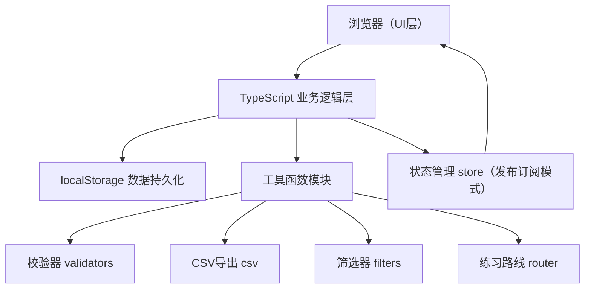
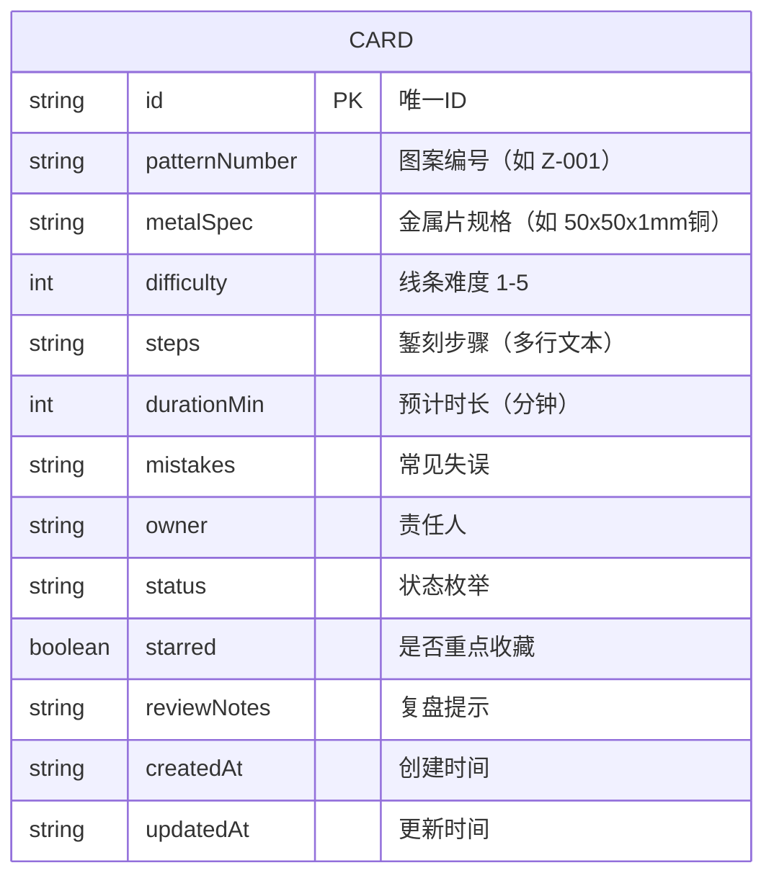

## 1. 架构设计



纯前端架构，无后端。所有数据通过 localStorage 持久化。

## 2. 技术描述
- **前端框架**：原生 TypeScript（无 React/Vue），使用 DOM 操作 + 组件化类封装
- **构建工具**：Vite 5.x
- **样式方案**：原生 CSS + CSS Variables（主题系统）
- **状态管理**：自研极简 Store（发布订阅模式，类似观察者模式）
- **数据持久化**：localStorage
- **图标**：Lucide（通过 CDN 或内联 SVG）
- **包管理**：pnpm / npm

## 3. 目录结构
```
e:\solocode\0620\zxy-2192-1
├── index.html                 入口HTML
├── vite.config.ts            Vite配置
├── tsconfig.json             TS配置
├── package.json              项目依赖
└── src/
    ├── main.ts               应用入口
    ├── types/
    │   └── index.ts          类型定义（Card, Status, Difficulty等）
    ├── store/
    │   └── index.ts          状态管理Store
    ├── utils/
    │   ├── storage.ts        localStorage封装
    │   ├── validators.ts     智能校验函数
    │   ├── filters.ts        筛选逻辑
    │   ├── csv.ts            CSV导出
    │   └── router.ts         练习路线生成
    ├── components/
    │   ├── App.ts            根组件
    │   ├── Toolbar.ts        筛选工具栏
    │   ├── AlertPanel.ts     校验警告面板
    │   ├── CardGrid.ts       卡片网格
    │   ├── CardItem.ts       单张卡片
    │   ├── CardForm.ts       新增/编辑表单
    │   └── RouteView.ts      练习路线视图
    └── styles/
        ├── variables.css     CSS变量/主题
        ├── base.css          基础样式重置
        ├── layout.css        布局样式
        └── components.css    组件样式
```

## 4. 数据模型

### 4.1 数据模型定义


### 4.2 状态枚举
| 状态值 | 显示文本 |
|--------|----------|
| pending | 待练习 |
| in_progress | 练习中 |
| need_help | 需讲解 |
| showcase | 可展示 |
| postponed | 暂缓 |

### 4.3 校验规则定义
```typescript
interface ValidationAlert {
  type: 'duplicate_number' | 'duration_too_long' | 'mistakes_empty' | 'owner_overloaded' | 'starred_no_notes';
  severity: 'warning' | 'error';
  message: string;
  cardIds: string[];
}
```

## 5. 核心函数签名
```typescript
// store
addCard(card: Omit<Card, 'id' | 'createdAt' | 'updatedAt'>): Card
updateCard(id: string, patch: Partial<Card>): void
deleteCard(id: string): void
duplicateCard(id: string): Card
batchUpdateStatus(ids: string[], status: CardStatus): void
toggleStar(id: string): void

// validators
validateAll(cards: Card[]): ValidationAlert[]

// filters
filterCards(cards: Card[], criteria: FilterCriteria): Card[]

// csv
exportToCSV(cards: Card[]): void // 触发浏览器下载

// router
generatePracticeRoute(cards: Card[]): Card[] // 按难度递增排序
```
